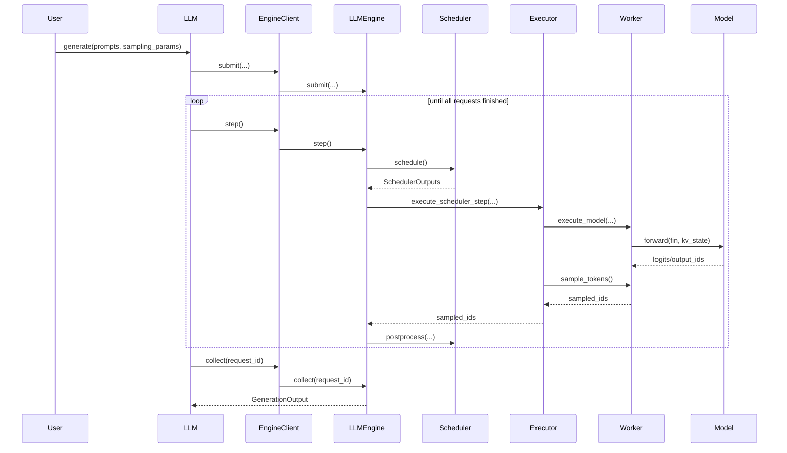
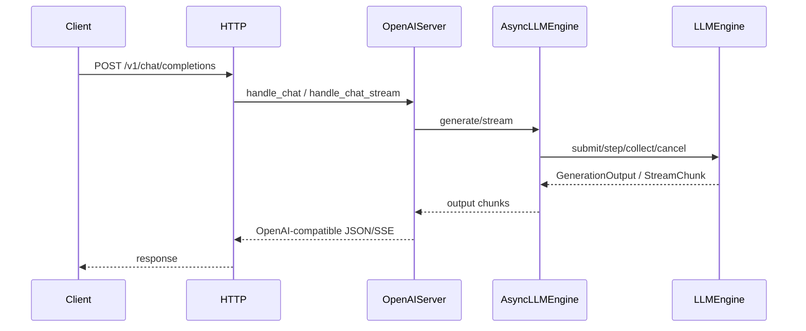

# LLM 推理栈设计概览（2026-03-14）

本文描述当前仓库代码对应的真实设计口径，覆盖离线推理、在线服务、KV Cache、ParallelContext、Qwen2 适配和 TP 主链路。

关联文档：

1. 需求：`doc/requirements_2026-03-14.md`
2. 测试：`doc/test_plan_2026-03-14.md`
3. 性能验证：`doc/tutorial.md`
## 1. 当前设计结论

1. 当前主模型为 `Qwen2`，但栈设计已按“可接入多模型”组织。
2. 当前主 KV 语义为 `BLOCK`。
3. 当前 NVIDIA 性能主线为 `BLOCK + cuDNN`。
4. 当前 TP 设计已经从 `KvState` 解耦到 `ParallelContext`。
5. 当前服务主接口为 `OpenAI chat.completions`。

## 2. 系统分层

### 2.1 Python 层

1. `entrypoints/llm.py`
   - 离线入口
2. `engine/llm_engine.py`
   - 请求生命周期与 step loop
3. `engine/scheduler.py`
   - waiting/running 调度
4. `engine/executor.py`
   - 一次 step 的执行协调
5. `engine/worker.py`
   - 计算执行单元
6. `models/qwen2.py`
   - Qwen2 模型适配
7. `server/http_server.py`
   - HTTP/OpenAI 兼容服务

### 2.2 C++ 层

1. `src/llaisys/model.cc`
   - 通用模型、KV 状态、并行上下文 C API 实现
2. `src/llaisys/qwen2/qwen2_model.cpp`
   - Qwen2 执行逻辑
3. `src/llaisys/kv_cache/*`
   - paged KV cache
4. `src/llaisys/workspace/*`
   - 模型 workspace
5. `src/llaisys/weights/*`
   - 权重句柄
6. `src/ops/*`
   - 具体算子
7. `src/device/*`
   - CPU/NVIDIA runtime API

## 3. 关键对象模型

### 3.1 Model

职责：

1. 持有模型权重
2. 持有模型元信息
3. 执行 forward
4. 持有模型内 workspace 与 attention backend 状态
5. 绑定且只绑定一个 `ParallelContext`

当前实现：

- Python wrapper：`python/llaisys/models/qwen2.py`
- C++ 实现：`src/llaisys/qwen2/qwen2_model.cpp`
- 通用 handle：`src/llaisys/model.cc`

### 3.2 KvState

职责：

1. 管理 paged KV cache 容量与块布局
2. 维护 request/seq 对应的 KV 生命周期
3. 提供 prefix cache 和 stats

当前实现：

- C API：`llaisysKvStateCreate/Destroy/...`
- C++：`src/llaisys/model.cc` + `src/llaisys/kv_cache/*`
- Python 构造：`engine/runtime_factory.py`

### 3.3 ParallelContext

职责：

1. 管理 TP 运行态
2. 管理 communicator 生命周期
3. 保存 TP rank/local_rank/device_ids/backend/init_method
4. 在 model 初始化后一次性绑定到 model

当前实现：

- C API：
  - `llaisysParallelContextCreate`
  - `llaisysParallelContextDestroy`
  - `llaisysModelBindParallelContext`
- C++：`src/llaisys/model.cc`
- Python 创建：`engine/runtime_factory.py`

## 4. 离线推理执行链

### 4.1 调用链

### 4.2 关键点

1. `LLM.generate` 先 submit 全部请求，再驱动 step。
2. `LLMEngine` 维护请求状态机与 finished outputs。
3. `Scheduler` 先做 prefill admission，再做 decode。
4. `Executor` 只编排执行，不持有策略。
5. `Worker` 持有 `model + kv_state + parallel_context + sampler`。

## 5. 在线服务执行链

当前在线设计特点：

1. Server 只做协议适配和序列化。
2. Reasoning 解析在 `server/openai_server.py` 中完成。
3. SSE 流式输出按 `StreamChunk -> OpenAI chunk` 转换。
4. 取消通过 `/v1/requests/{id}/cancel` 透传到 Engine。

## 6. Scheduler 与 BlockManager

### 6.1 调度语义

1. `waiting` 队列保存尚未进入运行态的请求。
2. `running` 队列保存已分配 block 的请求。
3. prefill 优先 admission。
4. decode 阶段逐 request 分配 1 token。
5. `max_num_seqs` 与 `max_num_batched_tokens` 是主调度约束。

### 6.2 BlockManager 职责

1. block 分配与释放
2. prefix cache 命中/失配统计
3. block_table 维护
4. can_allocate/can_append/may_append

## 7. GPU Worker 设计

### 7.1 初始化

`GPUModelRunner` 初始化阶段完成：

1. 读取模型 meta
2. 选择 TP 本地设备
3. 创建 `KvState`
4. 创建 `ParallelContext`
5. bind `ParallelContext` 到 model
6. 创建 sampler
7. 预分配 CPU/GPU buffer

### 7.2 执行

1. `_prepare_inputs` 构造 forward metadata
2. `execute_model` 调 `llaisysModelForward`
3. `sample_tokens` 调 `llaisysSamplerSample`
4. decode/prefill 共用统一 forward 协议

### 7.3 BLOCK + cuDNN 元数据

当前 `GPUModelRunner` 会为 NVIDIA/BLOCK 路径构造：

1. `input_ids`
2. `pos_ids`
3. `logits_indices`
4. `slot_mapping`
5. `block_tables`
6. `cudnn_seq_lens_q`
7. `cudnn_seq_lens_kv`
8. `cudnn_page_table`
9. `cudnn_qo_ragged_offset`

目的：

- 让 C++ forward 只消费标准化元数据，不再回 Python 做隐式推断。

## 8. Qwen2 模型适配

### 8.1 Python 适配层

`python/llaisys/models/qwen2.py` 负责：

1. 读取 `config.json`
2. 解析模型 meta
3. 读取 safetensors
4. 把 HF 权重名映射到 C++ weight slot
5. 在 TP 下对权重按字段做本地切分

### 8.2 TP 分片规则

当前字段分片规则是显式表驱动的：

1. 列并行：Q/K/V, gate, up
2. 行并行：O, down
3. 复制参数：embedding/norm 等不切分

这部分目前保留在模型私有层
## 9. Qwen2 C++ 执行设计

### 9.1 运行态

`Qwen2Model` 持有：

1. `meta_`
2. weight slots
3. `runtime_`
4. `workspace_`
5. `paged_attn_backend_`
6. `cudnn_runtime_state_`
7. TP local shape:
   - `tp_size_`
   - `tp_rank_`
   - `tp_nh_local_`
   - `tp_nkvh_local_`
   - `tp_di_local_`

### 9.2 TP 绑定

`bind_parallel_context(...)` 负责：

1. 设置 TP rank/device 语义
2. 计算本地 shape
3. 接收 communicator 指针
4. 校验 `nh/nkvh/di` 可整除性

### 9.3 allreduce 插点

当前 TP collective 插在：

1. attention output projection 后
2. MLP down projection 后

即典型张量并行同步点。

## 10. KvState 与 ParallelContext 解耦

当前设计与旧设计的关键差异：

1. 旧设计把 TP 状态挂在 `kv_state`。
2. 当前设计把 TP 状态迁到 `ParallelContext`。
3. `kv_state` 现在只描述 KV 运行态。
4. communicator 生命周期不再由 `Qwen2Model` 管理。

收益：

1. 职责更清晰
2. `tp=1` 与多卡路径共享一套更干净的模型接口
3. 新模型接入时不需要复活旧的 `kv_state parallel init` 结构

## 11. 当前已知约束

1. 当前仅支持 `OpenAI chat.completions`，未完整覆盖其他 API。
2. 当前 TP 只支持多进程 + NCCL。
3. 当前 TP 尚未做通信 overlap 与 fused QKV。
4. 当前主观测模型仍是 Qwen2 系列。

## 12. 需求到模块映射

| 需求 | 当前模块 |
|---|---|
| 统一离线入口 | `entrypoints/llm.py` |
| 请求状态机 | `engine/llm_engine.py` |
| 调度 | `engine/scheduler.py` |
| 执行协调 | `engine/executor.py` |
| 模型执行单元 | `engine/worker.py`, `engine/gpu_model_runner.py` |
| 模型适配 | `models/qwen2.py` |
| KV 运行态 | `src/llaisys/model.cc`, `src/llaisys/kv_cache/*` |
| TP 运行态 | `src/llaisys/model.cc`, `engine/runtime_factory.py` |
| Qwen2 执行 | `src/llaisys/qwen2/qwen2_model.cpp` |
| 在线服务 | `server/http_server.py`, `server/openai_server.py` |
