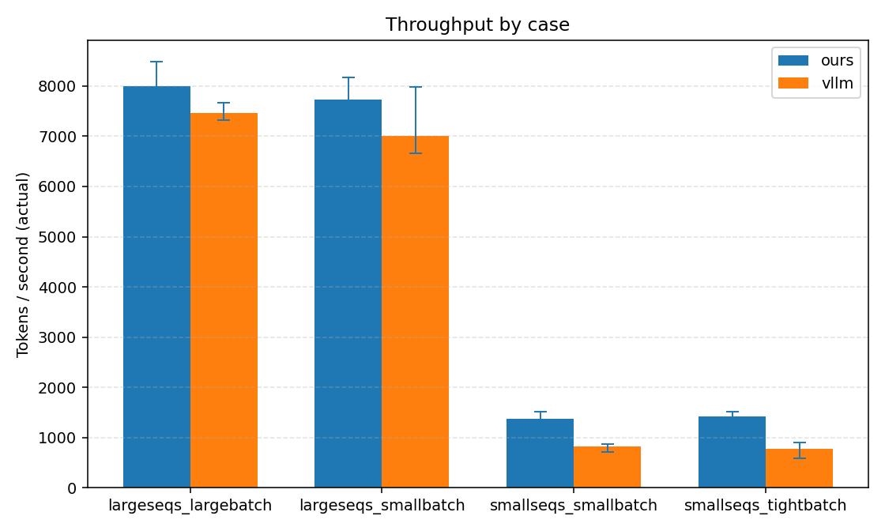
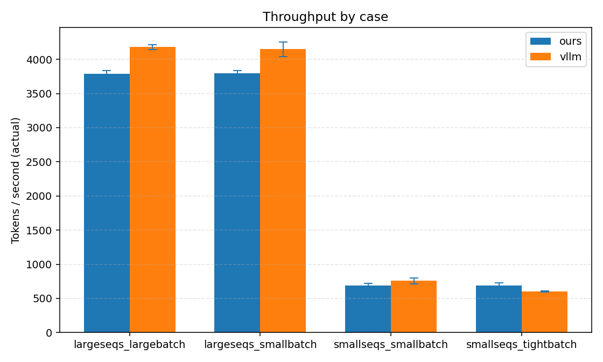
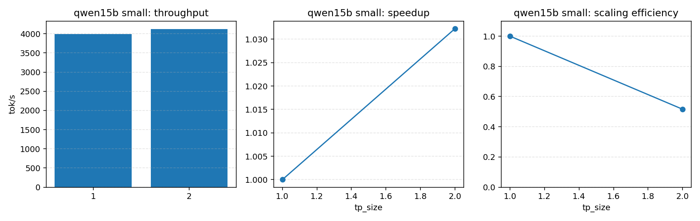
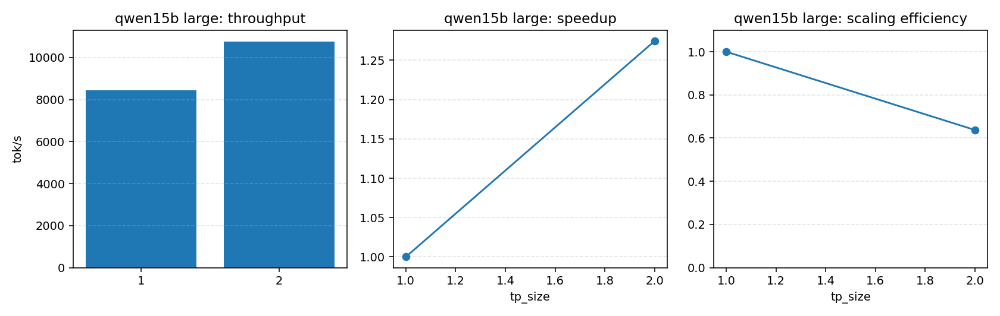
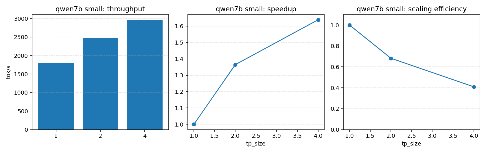
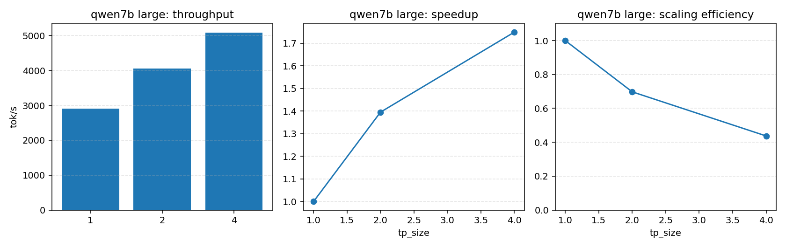

# 一 .CPU (Linux)基础示例:
## 编译项目
```bash
xmake f --mode=release --nv-gpu=n
xmake -j1
xmake install

pip install -e ./python[test]
```
## 启动server服务
```bash
PYTHONPATH=python python -m llaisys.server \
  --model-path /home/xiaohajiayou/NovaInfer/models/deepseek-ai/DeepSeek-R1-Distill-Qwen-1.5B \
  --model-type qwen2 \
  --device cpu \
  --kv-cache-memory-utilization 0.9 \
  --host 127.0.0.1 \
  --port 8000 \
  --verbose
```
### 测试服务
Non-stream:

```bash
curl -s http://127.0.0.1:8000/v1/chat/completions \
  -H "Content-Type: application/json" \
  -d '{"model":"qwen2","messages":[{"role":"user","content":"hello"}],"stream":false,"max_tokens":32}'
```

Stream (SSE):

```bash
curl -N http://127.0.0.1:8000/v1/chat/completions \
  -H "Content-Type: application/json" \
  -d '{"model":"qwen2","messages":[{"role":"user","content":"hello"}],"stream":true,"max_tokens":32}'
```

## 启动 Web UI static server

```bash
python -m http.server 8081 -d webui
```

注意右上角填推理服务器端口地址


# 二 .MXMACA / 沐曦平台 基础示例:
## 编译项目
```bash
要求本机已安装 MXMACA，且默认安装在：
/opt/maca
cd /root/llaisys
xmake f --root -c --maca-gpu=y --maca-cudnn=n
xmake --root -r -j4

pip install -e ./python[test]
```
## 启动server服务
```bash
PYTHONPATH=python python -m llaisys.server \
  --model-path /root/models/deepseek-ai/DeepSeek-R1-Distill-Qwen-1.5B \
  --model-type qwen2 \
  --device nvidia \
  --kv-cache-memory-utilization 0.9 \
  --host 127.0.0.1 \
  --port 8000 \
  --verbose
```
### 测试服务
Non-stream:

```bash
curl -s http://127.0.0.1:8000/v1/chat/completions \
  -H "Content-Type: application/json" \
  -d '{"model":"qwen2","messages":[{"role":"user","content":"hello"}],"stream":false,"max_tokens":32}'
```

Stream (SSE):

```bash
curl -N http://127.0.0.1:8000/v1/chat/completions \
  -H "Content-Type: application/json" \
  -d '{"model":"qwen2","messages":[{"role":"user","content":"hello"}],"stream":true,"max_tokens":32}'
```

## 启动 Web UI static server

```bash
python -m http.server 8081 -d webui
```

注意右上角填推理服务器端口地址


# 三 .NVIDIA CUDA 基础示例:

### cudnn paged attention 版本
### 1. 环境配置
为了进一步提升性能,nvidia通路使用了cuDNN dynamic shape for sdpa
https://github.com/NVIDIA/cudnn-frontend/blob/v1.18.0/samples/cpp/sdpa/fp16_dynamic_shapes.cpp
故要求cudnn版本 >= 9.18:
- 1）下载cuDNN,并解压到用户目录
```
mkdir -p $HOME/opt

cd $HOME/opt

wget https://developer.download.nvidia.com/compute/cudnn/redist/cudnn/linux-x86_64/cudnn-linux-x86_64-9.18.1.3_cuda12-archive.tar.xz

tar -xf cudnn-linux-x86_64-9.18.1.3_cuda12-archive.tar.xz -C $HOME/opt
```
- 2）设置环境变量
```
export CUDNN_ROOT=$HOME/opt/cudnn-linux-x86_64-9.18.1.3_cuda12-archive
export LD_LIBRARY_PATH=$CUDNN_ROOT/lib:$LD_LIBRARY_PATH
export CPATH=$CUDNN_ROOT/include:$CPATH
export LIBRARY_PATH=$CUDNN_ROOT/lib:$LIBRARY_PATH
```
这三类变量的作用分别是：
LD_LIBRARY_PATH：运行时找 .so
CPATH：编译时找头文件
LIBRARY_PATH：链接时找库
- 3）验证cudnn版本>=9.18
```
python - <<'PY'
import ctypes, sys
lib = ctypes.cdll.LoadLibrary("libcudnn.so.9")
lib.cudnnGetVersion.restype = ctypes.c_size_t
v = int(lib.cudnnGetVersion())
major = v // 10000
minor = (v % 10000) // 100
patch = v % 100
print(f"detected cuDNN: {major}.{minor}.{patch} ({v})")
if not ((major > 9) or (major == 9 and minor >= 18)):
    raise SystemExit("ERROR: NovaInfer requires cuDNN >= 9.18")
PY
```

### 2.编译项目
```
xmake f -c --mode=release --nv-gpu=y --nv-cudnn=y --nv-nccl=y
xmake -j8
xmake install

pip install -e ./python[test]
```
### 3.启动server服务
```bash
export CUDNN_ROOT=$HOME/opt/cudnn-linux-x86_64-9.18.1.3_cuda12-archive
export LD_LIBRARY_PATH=$CUDNN_ROOT/lib:$LD_LIBRARY_PATH
export CPATH=$CUDNN_ROOT/include:$CPATH
export LIBRARY_PATH=$CUDNN_ROOT/lib:$LIBRARY_PATH
CUDA_VISIBLE_DEVICES=5 \
LLAISYS_CUDA_PAGED_ATTN_BACKEND=cudnn \
PYTHONPATH=python python -m llaisys.server \
  --model-path /home/xiaohajiayou/NovaInfer/models/deepseek-ai/DeepSeek-R1-Distill-Qwen-1.5B \
  --model-type qwen2 \
  --device nvidia \
  --kv-cache-memory-utilization 0.9 \
  --host 127.0.0.1 \
  --port 8000 \
  --verbose
```
### 测试服务
Non-stream:

```bash
curl -s http://127.0.0.1:8000/v1/chat/completions \
  -H "Content-Type: application/json" \
  -d '{"model":"qwen2","messages":[{"role":"user","content":"hello"}],"stream":false,"max_tokens":32}'
```

Stream (SSE):

```bash
curl -N http://127.0.0.1:8000/v1/chat/completions \
  -H "Content-Type: application/json" \
  -d '{"model":"qwen2","messages":[{"role":"user","content":"hello"}],"stream":true,"max_tokens":32}'
```

### 启动 Web UI static server
```bash
python -m http.server 8081 -d webui
```

注意右上角填推理服务器端口地址

## cudnn paged attention 版本 (性能相对较差,高性能走cudnn版本)
### 1.编译项目
```
xmake f -c --mode=release --nv-gpu=y --nv-cudnn=y --nv-nccl=y
xmake -j8
xmake install

pip install -e ./python[test]
```
### 2.启动server服务 (性能相对较差,高性能走cudnn版本)
```bash
LLAISYS_CUDA_PAGED_ATTN_BACKEND=native
CUDA_VISIBLE_DEVICES=0 \
PYTHONPATH=python python -m llaisys.server \
  --model-path /home/xiaohajiayou/NovaInfer/models/deepseek-ai/DeepSeek-R1-Distill-Qwen-1.5B \
  --model-type qwen2 \
  --device nvidia \
  --kv-cache-memory-utilization 0.9 \
  --host 127.0.0.1 \
  --port 8665 \
  --verbose
```

### 测试服务
Non-stream:

```bash
curl -s http://127.0.0.1:8000/v1/chat/completions \
  -H "Content-Type: application/json" \
  -d '{"model":"qwen2","messages":[{"role":"user","content":"hello"}],"stream":false,"max_tokens":32}'
```

Stream (SSE):

```bash
curl -N http://127.0.0.1:8000/v1/chat/completions \
  -H "Content-Type: application/json" \
  -d '{"model":"qwen2","messages":[{"role":"user","content":"hello"}],"stream":true,"max_tokens":32}'
```

### 启动 Web UI static server

```bash
python -m http.server 8081 -d webui
```

注意右上角填推理服务器端口地址


# 四 . NVIDIA CUDA  TP并行示例:
## 启动server服务
```bash
export CUDNN_ROOT=$HOME/opt/cudnn-linux-x86_64-9.18.1.3_cuda12-archive
export LD_LIBRARY_PATH=$CUDNN_ROOT/lib:$LD_LIBRARY_PATH
export CPATH=$CUDNN_ROOT/include:$CPATH
export LIBRARY_PATH=$CUDNN_ROOT/lib:$LIBRARY_PATH
CUDA_VISIBLE_DEVICES=5,6 \
LLAISYS_CUDA_PAGED_ATTN_BACKEND=cudnn \
PYTHONPATH=python python -m llaisys.server \
  --model-path /home/xiaohajiayou/NovaInfer/models/deepseek-ai/DeepSeek-R1-Distill-Qwen-1.5B \
  --model-type qwen2 \
  --device nvidia \
  --tensor-parallel-size 2 \
  --distributed-executor-backend mp \
  --tensor-parallel-device-ids 0,1 \
  --kv-cache-memory-utilization 0.9 \
  --host 127.0.0.1 \
  --port 8675 \
  --verbose
```
- 可选择使用native,即:
```
LLAISYS_CUDA_PAGED_ATTN_BACKEND=native
```
- 若选择cudnn paged attention 版本,需要保证cudnn>=9.18,即:
```
export CUDNN_ROOT=$HOME/opt/cudnn-linux-x86_64-9.18.1.3_cuda12-archive
export LD_LIBRARY_PATH=$CUDNN_ROOT/lib:$LD_LIBRARY_PATH
export CPATH=$CUDNN_ROOT/include:$CPATH
export LIBRARY_PATH=$CUDNN_ROOT/lib:$LIBRARY_PATH
LLAISYS_CUDA_PAGED_ATTN_BACKEND=cudnn \
```
## 启动 Web UI static server
和上述基础示例步骤一致即可


# 五 .性能优化
## cpu推理性能优化-openmp
通过openmp优化linear和attention算子
### Linear 算子性能对比（OpenMP 优化）

### Linear 算子性能对比（OpenMP 优化前后）

| 状态 | out shape | x shape | w shape | dtype | Torch Time (ms) | LLAISYS Time (ms) | LLAISYS / Torch | 相对优化前提升 |
|---|---|---|---|---|---:|---:|---:|---:|
| 优化前 | (512, 4096) | (512, 4096) | (4096, 4096) | f32 | 36.89025 | 10289.27141 | 278.92x |- |
| 优化后 | (512, 4096) | (512, 4096) | (4096, 4096) | f32 | 42.70074 | 223.55501 | 5.24x | 46.03x |

### Attention 算子性能对比（优化前后）

| 状态 | qlen | kvlen | nh | nkvh | hd | dtype | Torch Time (ms) | LLAISYS Time (ms) | 优化收益 |
|---|---:|---:|---:|---:|---:|---|---:|---:|---|
| 优化前 | 5 | 11 | 4 | 2 | 8 | f32 | 97.74043 | 59.16621 |- |
| 优化后 | 5 | 11 | 4 | 2 | 8 | f32 | 96.20656 | 0.00781 | 7575.70x |
## nvidia平台性能优化-单卡 A100
在 A100 集群上的性能验证结果，单卡 A100 上的 ours vs vLLM 通用基准
2. 多卡 A100 上的 ours Tensor Parallel 吞吐扩展矩阵。
### 硬件与软件

- GPU: `NVIDIA A100-SXM4-80GB`
- GPU 数量: `8`
- 单卡显存: `81920 MiB`
- Driver: `570.133.20`
- CUDA toolkit: `12.8`（`/usr/local/cuda/bin/nvcc`, `Build cuda_12.8.r12.8/compiler.35404655_0`）
- cuDNN 运行时: `9.18.1`（`cudnnGetVersion() = 91801`）
- NCCL 动态库来自 Python 环境：`.../.venv/lib/python3.12/site-packages/nvidia/nccl/lib`
### 工作负载
1. 单次对比case:

| Case | num_seqs | Input Len | Output Len | max_num_seqs | max_num_batched_tokens | KV Cache Utilization | vLLM Fair Mode |
|---|---:|---|---|---|---|---|---|
| largeseqs_largebatch | 256 | 100–1024 | 100–1024 | 256 | 16384 | 0.9 | True |

### 行命令
```
export CUDNN_ROOT=opt/cudnn-linux-x86_64-9.18.1.3_cuda12-archive
export LD_LIBRARY_PATH=$CUDNN_ROOT/lib:$LD_LIBRARY_PATH
export CPATH=$CUDNN_ROOT/include:$CPATH
export LIBRARY_PATH=$CUDNN_ROOT/lib:$LIBRARY_PATH
CUDA_VISIBLE_DEVICES=0 \
  LLAISYS_CUDA_PAGED_ATTN_BACKEND=cudnn \
   python scripts/bench_compare_vllm.py\
    --model-path /home/xiaohajiayou/NovaInfer/models/deepseek-ai/DeepSeek-R1-Distill-Qwen-1.5B \
    --backend novainfer \
    --num-seqs 256 \
    --min-input-len 100 \
    --max-input-len 1024 \
    --min-output-len 100 \
    --max-output-len 1024 \
    --max-model-len 4096 \
    --seed 0 \
    --max-num-seqs 256 \
    --max-num-batched-tokens 16384
```
2. 使用 `scripts/run_perf_experiments.py` 的四组 case：

| Case | num_seqs | Input Len | Output Len | max_num_seqs | max_num_batched_tokens | KV Cache Utilization | vLLM Fair Mode |
|---|---:|---|---|---|---|---|---|
| smallseqs_tightbatch | 20 | 100–1024 | 100–1024 | 20 | 4096 | 0.7 | True |
| smallseqs_smallbatch | 20 | 100–1024 | 100–1024 | 20 | 8192 | 0.7 | True |
| largeseqs_smallbatch | 256 | 100–1024 | 100–1024 | 256 | 8192 | 0.5 | True |
| largeseqs_largebatch | 256 | 100–1024 | 100–1024 | 256 | 16384 | 0.5 | True |

统一条件：

1. `CUDA_VISIBLE_DEVICES=5`
2. `repeats=5`
3. `seed_base=3000`
4. `LLAISYS_CUDA_PAGED_ATTN_BACKEND=cudnn`
5. vLLM 侧使用 fair-mode()
    - 开启eager_mode:和我们的实现同步(因为我们没做对应的cudagraph且没有torch_compile)
    - 关闭chunk_prefill:和我们的实现同步(因为我们没做对应的chunk_prefill)
    - 关闭asyncscheduling:和我们的实现同步(因为我们没做对应的异步调度)

### 行命令
#### deepseek-ai/DeepSeek-R1-Distill-Qwen-1.5B
```bash
export CUDNN_ROOT=$HOME/opt/cudnn-linux-x86_64-9.18.1.3_cuda12-archive
export LD_LIBRARY_PATH=$CUDNN_ROOT/lib:$LD_LIBRARY_PATH
export CPATH=$CUDNN_ROOT/include:$CPATH
export LIBRARY_PATH=$CUDNN_ROOT/lib:$LIBRARY_PATH
CUDA_VISIBLE_DEVICES=5 \
python scripts/run_perf_experiments.py \
  --model-path /home/xiaohajiayou/NovaInfer/models/deepseek-ai/DeepSeek-R1-Distill-Qwen-1.5B \
  --repeats 5 \
  --seed-base 3000 \
  --cases smallseqs_tightbatch smallseqs_smallbatch largeseqs_smallbatch largeseqs_largebatch \
  --backend-order novainfer vllm \
  --cudnn-backend cudnn \
  --output-jsonl perf_results_a100_2026-03-15.jsonl \
  --output-log-dir perf_logs_a100_2026-03-15
```
### 测试结果

| 场景 | ours | vLLM | 比值（ours/vLLM） |
|---|---:|---:|---:|
| `smallseqs_tightbatch` | 1454.93 | 833.85 | 1.745x |
| `smallseqs_smallbatch` | 1431.60 | 857.90 | 1.669x |
| `largeseqs_smallbatch` | 7881.65 | 6714.42 | 1.174x |
| `largeseqs_largebatch` | 7830.52 | 7433.24 | 1.053x |

#### deepseek-ai/DeepSeek-R1-Distill-Qwen-7B
```bash
export CUDNN_ROOT=$HOME/opt/cudnn-linux-x86_64-9.18.1.3_cuda12-archive
export LD_LIBRARY_PATH=$CUDNN_ROOT/lib:$LD_LIBRARY_PATH
export CPATH=$CUDNN_ROOT/include:$CPATH
export LIBRARY_PATH=$CUDNN_ROOT/lib:$LIBRARY_PATH
CUDA_VISIBLE_DEVICES=5 \
python scripts/run_perf_experiments.py \
  --model-path /home/xiaohajiayou/NovaInfer/models/deepseek-ai/DeepSeek-R1-Distill-Qwen-7B \
  --repeats 5 \
  --seed-base 3000 \
  --cases smallseqs_tightbatch smallseqs_smallbatch largeseqs_smallbatch largeseqs_largebatch \
  --backend-order novainfer vllm \
  --cudnn-backend cudnn \
  --output-jsonl perf_results_a100_2026-03-15.jsonl \
  --output-log-dir perf_logs_a100_2026-03-15
```
### 测试结果

| 场景 | ours | vLLM | 比值（ours/vLLM） |
|---|---:|---:|---:|
| `smallseqs_tightbatch` | 685.54 | 603.17 | 1.137x |
| `smallseqs_smallbatch` | 686.06 | 756.42 | 0.907x |
| `largeseqs_smallbatch` | 3796.44 | 4150.38 | 0.915x |
| `largeseqs_largebatch` | 3790.51 | 4179.34 | 0.907x |

### 结论
- 1.5B模型
    - 在当前 A100 上，ours 在四组 workload 中全部领先公平状态下的vLLM。
    - 尤其在小负载场景下，ours 的性能优势更明显。(可能原因是瓶颈不在gpu计算,而在python调度侧)
- 7B模型
    - 在当前 A100 上，ours 在小负载 workload 中领先公平状态下的vLLM。
    - 随着负载增大,ours 的性能优势减小,持平vllm 90%的性能
    - 可能原因为,随着瓶颈变成gpu计算,算子优化要求更高,这点vllm做的更好
## nvidia平台性能优化-多卡并行 A100
在 A100 集群上的性能验证结果，多卡 A100 上的 ours Tensor Parallel 吞吐扩展矩阵。
### 矩阵设计

模型：
1. `DeepSeek-R1-Distill-Qwen-1.5B`
2. `DeepSeek-R1-Distill-Qwen-7B`

负载：
1. `small`
2. `large`

TP：
1. `1.5B`: `tp=1,2`
2. `7B`: `tp=1,2,4`

### 口径

1. TP 吞吐统一取：
   - `global_tokens / max(rank_run_seconds)`
2. speedup 统一相对同模型、同负载、`tp=1` 基线。
3. scaling efficiency 定义为：
   - `speedup / tp_size`
4. 所有 TP 结果默认建立在 HF parity 已通过的前提上。

### 运行命令

```bash
export CUDNN_ROOT=$HOME/opt/cudnn-linux-x86_64-9.18.1.3_cuda12-archive
export LD_LIBRARY_PATH=$CUDNN_ROOT/lib:$LD_LIBRARY_PATH
export CPATH=$CUDNN_ROOT/include:$CPATH
export LIBRARY_PATH=$CUDNN_ROOT/lib:$LIBRARY_PATH
python scripts/run_tp_perf_experiments.py \
  --repeats 3 \
  --seed-base 4000 \
  --output-jsonl tp_perf_results_a100_2026-03-14.jsonl \
  --output-log-dir tp_perf_logs_a100_2026-03-14
```

### 图：1.5B small TP 扩展


### 图：1.5B large TP 扩展


### 图：7B small TP 扩展


### 图：7B large TP 扩展


### TP 中位数结果

#### 1.5B

| 负载 | tp_size | 中位数吞吐 | speedup vs tp1 | scaling efficiency |
|---|---:|---:|---:|---:|
| `small` | 1 | 3995.04 | 1.000x | 1.000 |
| `small` | 2 | 4123.95 | 1.032x | 0.516 |
| `large` | 1 | 8444.73 | 1.000x | 1.000 |
| `large` | 2 | 10764.15 | 1.275x | 0.637 |

#### 7B

| 负载 | tp_size | 中位数吞吐 | speedup vs tp1 | scaling efficiency |
|---|---:|---:|---:|---:|
| `small` | 1 | 1805.90 | 1.000x | 1.000 |
| `small` | 2 | 2464.04 | 1.364x | 0.682 |
| `small` | 4 | 2958.40 | 1.638x | 0.410 |
| `large` | 1 | 2910.81 | 1.000x | 1.000 |
| `large` | 2 | 4060.86 | 1.395x | 0.698 |
| `large` | 4 | 5090.52 | 1.749x | 0.437 |

### TP 结果解读

1. `1.5B` 在 small 负载上 TP2 几乎没有收益，说明这组工作负载通信与固定开销占比已经压过了计算收益。
2. `1.5B` 在 large 负载上 TP2 有约 `1.27x` 收益，说明更大批量能更好地摊薄通信与调度固定成本。
3. `7B` 在 small/large 两组负载上都能从 TP 获益，其中 large 负载更稳定。
4. `7B large tp4` 中位数约 `5090.52 tok/s`，相对 `tp1` 为 `1.75x`；收益明显


# 六 .测试验证
本项目基于pytest运行测试自动抓取
```
export MODEL_PATH=/home/xiaohajiayou/NovaInfer/models/deepseek-ai/DeepSeek-R1-Distill-Qwen-1.5B
pytest --rootdir=./ test
```